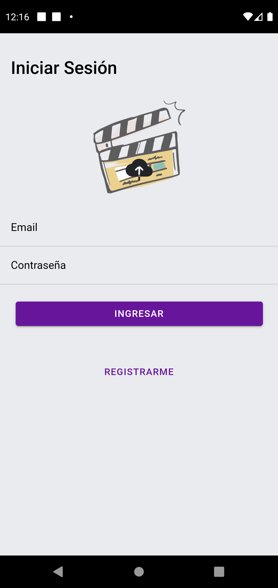
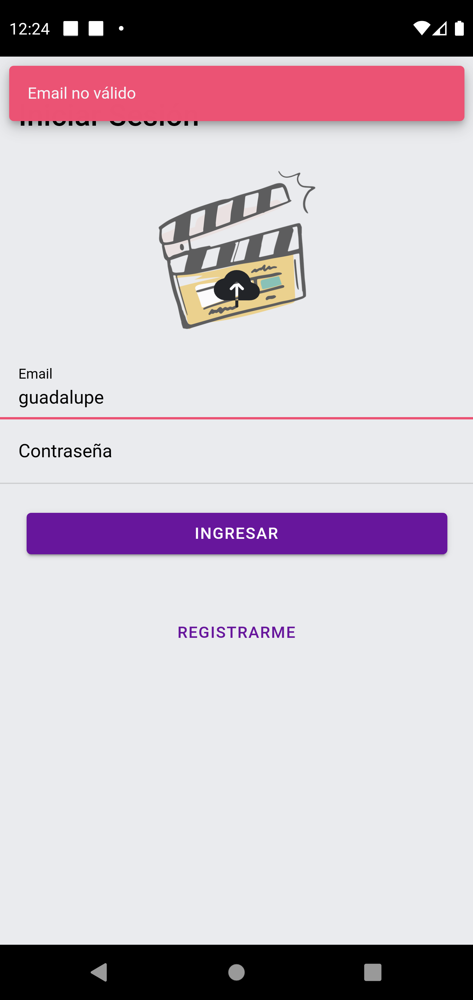
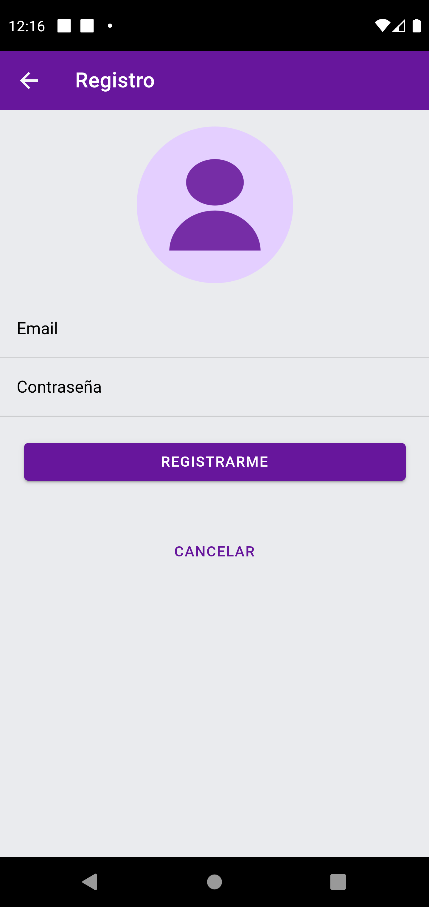
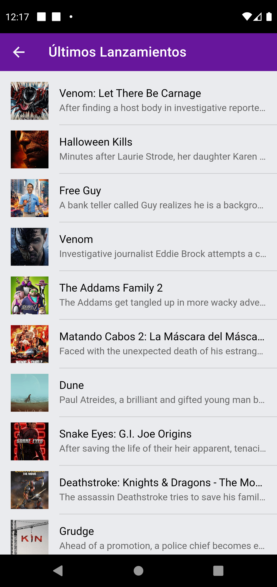
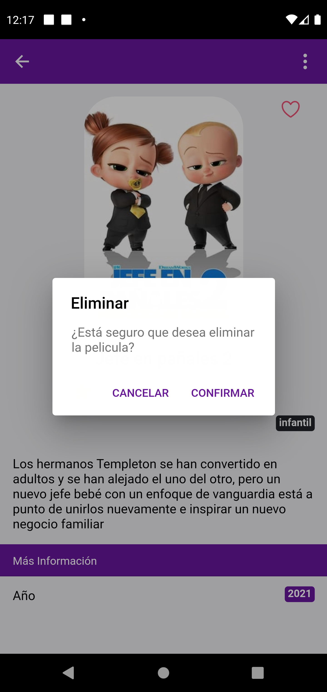

# IonicMovieApp 🎥

Aplicación Demo creada con Ionic 5.

Funcionalidades:

-   Inicio de sesión y registro de usuarios
-   Validación de Formularios
-   API y datos locales
-   Mostrar Listado de peliculas
-   Editar pelicula
-   Calificar pelicula
-   Cambiar imagen al iniciar sesión

## Comenzando 🚀

### Levantar Aplicación

```bash
git clone https://github.com/guadalavila/ionic-movie-app.git
```

```bash
npm install
```

```bash
ionic serve o ionic serve --lab
```

#### Instalar en dispositivo

```bash
ionic build

ionic cap run android

ionic cap run ios
```

```bash
npm install jetifier
npx jetify
npx cap sync android
```

#### Crear APK modo depuración

```bash
cd android
./gradlew assembleDebug
```

#### Crear APK modo release

```bash
cd android
./gradlew assembleRelease
```

#### Imagenes

<p align="center">
    
    
    
    
    
    
    
    

</p>
